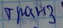

# Распознование текстов

Данный репозиторий содержит модель CNN+GRU/Resnet CTCLoss для распознования текста 
контеста: https://www.kaggle.com/competitions/vk-made-ocr/overview

Примеры текста:

# Оценка

Для оценки использовалась метрика Character Error Rate, 
значение которой на тестовой выборке составило `3.87371`
[Веса модели и конфигурационный файл](https://drive.google.com/file/d/1V9UHPZG71s1Mt_N3GNVuwCgwi5OwR_ZE/view?usp=drive_link)